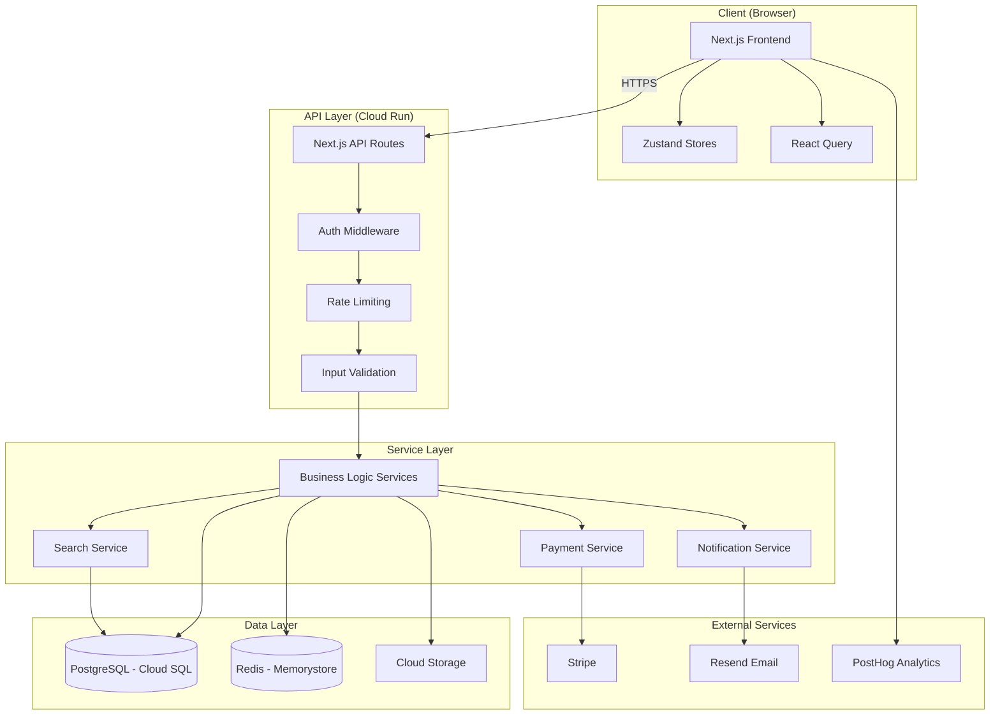

# NEXUS: The AI Software Factory — Complete Technical & Strategic Master Blueprint

> **Tagline:** Describe a software product in plain language. NEXUS deploys 30 specialized AI agents simultaneously — frontend, backend, database, security, DevOps, tests, docs, analytics, legal compliance, accessibility — and merges them into a production-deployed, fully tested application in under 10 minutes.

---

## SECTION 1: PROBLEM DEFINITION & VISION

### 1.1 The Software Development Cost & Speed Problem

The global software development industry hemorrhages **$50B+/year** in delayed and over-budget projects. According to the Standish Group CHAOS Report, **70% of software projects exceed their budgets**, and **52% deliver less than 60% of originally specified features**. The median enterprise software project takes 14.5 months from conception to first production deployment.

The root causes are structural:
- **Coordination overhead**: A 10-person engineering team spends 40-60% of its time on communication, meetings, code reviews, and context switching — not building
- **Sequential bottlenecks**: Frontend waits for API spec. API waits for database schema. Testing waits for implementation. DevOps waits for everything. The critical path is dominated by handoffs
- **Specialization scarcity**: A single developer cannot be expert-level in React, PostgreSQL, security hardening, accessibility, GDPR compliance, performance optimization, and CI/CD simultaneously. But small teams can't afford 30 specialists
- **The "last mile" problem**: Going from "code works on my machine" to "production-deployed with monitoring, security, and compliance" adds 2-6 weeks to every project

### 1.2 Current AI Coding Tools: What They Do & Where They Fall Short

| Tool | What It Does | Fundamental Limitation |
|------|-------------|----------------------|
| **GitHub Copilot** | Autocomplete-level suggestions, inline code generation | Single-file context. Cannot reason about system architecture. No deployment |
| **Cursor** | AI-assisted code editing with codebase context | Single-agent model. One conversation, one focus area at a time |
| **Devin (Cognition)** | Autonomous coding agent that can plan and execute tasks | Single generalist agent. Sequential execution. Hours for complex apps. No parallel specialization |
| **Replit Agent** | Builds and deploys simple apps from prompts | Limited to Replit's runtime. No enterprise-grade infrastructure. Shallow depth |
| **v0 / bolt.new** | UI generation from descriptions | Frontend only. No backend, database, auth, or deployment |

**The common failure**: Every existing tool uses a **single-agent paradigm** — one AI model context trying to hold the entire application in its head, sequentially generating file after file. This is like asking one person to simultaneously be the architect, plumber, electrician, painter, and inspector of a building. It produces shallow, toy-quality output.

### 1.3 The Insight: Single-Agent Coding Is the Wrong Paradigm

Real software teams are multi-disciplinary. A production application is built by:
- A product manager defining requirements
- A system architect designing the structure
- Frontend engineers building the UI
- Backend engineers building APIs
- A DBA designing the schema
- A security engineer hardening the system
- A DevOps engineer setting up CI/CD
- A QA engineer writing tests
- A technical writer creating documentation

**NEXUS replicates this team structure with AI agents.** Instead of one generalist agent producing mediocre code across all domains, NEXUS deploys **30 specialist agents** that each have deep domain expertise, focused system prompts, and strict output contracts.

### 1.4 The 30-Agent Thesis: Why Specialization Depth Beats Generalist Breadth

The key insight comes from prompt engineering research: **a model with a narrowly scoped system prompt dramatically outperforms the same model with a broad, general prompt** on domain-specific tasks.

- A Gemini Flash agent prompted as "You are a PostgreSQL database architect. Your ONLY job is to produce optimal Prisma schemas with proper indexes, constraints, and relationships" produces significantly better database schemas than the same model prompted as "You are a full-stack developer. Build everything."
- Specialization enables **constraint enforcement**: each agent can have strict output JSON schemas, validation rules, and quality gates specific to its domain
- Specialization enables **parallelism**: 30 focused agents running simultaneously produce output in minutes, not hours

### 1.5 The "Zero to Deployed" Vision

NEXUS doesn't just generate code. It produces a **live, production-deployed, fully tested application** with:
- Working frontend accessible via public URL
- Backend API with authentication, authorization, and rate limiting
- Database with schema, migrations, and seed data
- CI/CD pipeline for future updates
- Test suite (unit, integration, E2E)
- Security hardening (OWASP compliance, CSP headers, input sanitization)
- Documentation (README, API docs, deployment guide)
- Legal compliance (privacy policy, cookie consent, GDPR)
- Accessibility (WCAG 2.1 AA)
- Analytics and monitoring
- SEO optimization

**The user provides a paragraph. NEXUS returns a URL.**

### 1.6 Primary Users

| Persona | Pain Point | NEXUS Value |
|---------|-----------|-------------|
| **Solo Founders** | Can't afford a dev team, need an MVP to validate an idea | Complete MVP in 10 minutes for ~$0.56 in compute cost |
| **Startup CTOs** | Need to prototype 5 ideas to find product-market fit | Rapid experimentation without engineering sprint cycles |
| **Enterprise Innovation Teams** | Internal tools take 6 months through IT procurement | Bypass queue, deploy internal tools immediately |
| **Hackathon Participants** | 24-48 hours to build something impressive | Production-quality app while competitors are still setting up boilerplate |
| **Agencies & Consultants** | Client demos and proof-of-concepts | Ship working prototypes in client meetings |
| **Educators & Students** | Learning full-stack development | See how all pieces fit together in a real application |

### 1.7 The North Star: NEXUS as the World's First AI Software Factory

NEXUS is not a code assistant. It is not a copilot. It is a **software factory** — an autonomous system that takes raw specifications and produces finished, deployed software products. The analogy is manufacturing: just as a car factory has specialized stations (chassis, engine, paint, electrical, QA), NEXUS has specialized agents that each perform one function at production quality.

The end state: **software development becomes a creative act, not an engineering slog.** Describe what you want. NEXUS builds it.

---

## SECTION 2: CORE TECHNICAL ARCHITECTURE

### 2.1 Full System Architecture: End-to-End Pipeline

```
USER INPUT (Natural Language Description)
         │
         ▼
┌─────────────────────────────────────────────┐
│           NEXUS ORCHESTRATOR                 │
│         (Cloud Run + Google ADK)             │
│                                              │
│  ┌─────────────┐    ┌──────────────────┐    │
│  │ Spec Parser  │───▶│ DAG Scheduler    │    │
│  └─────────────┘    └──────┬───────────┘    │
│                            │                 │
│  ┌─────────────────────────▼──────────────┐ │
│  │         WAVE EXECUTOR                   │ │
│  │                                         │ │
│  │  Wave 0: [PM]                           │ │
│  │  Wave 1: [Architect]                    │ │
│  │  Wave 2: [DB] [Auth] [EnvConfig]        │ │
│  │  Wave 3: [11 backend agents ∥]          │ │
│  │  Wave 4: [5 frontend+cross-cut ∥]       │ │
│  │  Wave 5: [5 quality agents ∥]           │ │
│  │  Wave 6: [4 finalization agents ∥]      │ │
│  └─────────────────────────┬──────────────┘ │
│                            │                 │
│  ┌─────────────────────────▼──────────────┐ │
│  │       MERGE & VALIDATION ENGINE         │ │
│  │  Contract Validator → Import Resolver   │ │
│  │  → Patch Applicator → Final Assembly    │ │
│  └─────────────────────────┬──────────────┘ │
│                            │                 │
│  ┌─────────────────────────▼──────────────┐ │
│  │       CI/CD PIPELINE (Cloud Build)      │ │
│  │  npm ci → build → test → docker →      │ │
│  │  migrate → seed → deploy → healthcheck  │ │
│  └─────────────────────────┬──────────────┘ │
│                            │                 │
└────────────────────────────┼────────────────┘
                             │
                             ▼
              ┌──────────────────────┐
              │   DEPLOYED APP       │
              │   (Cloud Run +       │
              │    Firebase Hosting)  │
              │                      │
              │   https://myapp.     │
              │   nexus.deploy.app   │
              └──────────────────────┘
```

### 2.2 The Complete 30-Agent Registry

#### Wave 0 — Foundation (Sequential)

**Agent 1: Product Manager**
- **Role**: Translates natural language input into structured product requirements
- **Input**: Raw user description (e.g., "Build me an Airbnb clone for pet sitting")
- **Output**: Structured PRD containing: feature list with priority (P0/P1/P2), user stories with acceptance criteria, tech stack recommendation, data entities identified, third-party services needed, MVP scope vs. future scope
- **Why first**: Every subsequent agent depends on knowing what to build
- **Estimated tokens**: 3K input → 4K output
- **Time**: ~45-60s (uses reasoning mode)

#### Wave 1 — Architecture Blueprint (Sequential)

**Agent 2: System Architect**
- **Role**: Designs the overall system structure, component interfaces, and technology choices
- **Input**: Product Manager PRD
- **Output**: Complete system design containing:
  - Module map (full file tree with every file path, owner agent, and export surface)
  - API surface (OpenAPI 3.1 spec skeleton)
  - Data model (entity-relationship diagram as structured JSON)
  - Tech stack confirmation (framework versions, database choice, hosting targets)
  - Inter-service communication patterns
  - Canonical TypeScript interface contracts that all agents must respect
  - Environment variable contract (names, types, which are secrets)
- **Why sequential**: This agent's output is the "constitution" for all downstream agents
- **Estimated tokens**: 5K input → 8K output
- **Time**: ~60-90s (largest output, reasoning mode)

#### Wave 2 — Data & Config Layer (3 agents in parallel)

**Agent 3: Frontend UI/UX Designer**
— *Moved to Wave 4; see below*

**Agent 7: Database Schema Designer**
- **Role**: Designs tables, relationships, indexes, and migrations
- **Input**: System Architect ERD + PRD data entities
- **Output**: `schema.prisma` with models, relations, indexes, enums; migration SQL; database selection rationale
- **File ownership**: `prisma/schema.prisma`, `prisma/migrations/**`
- **Time**: ~35-45s

**Agent 8: Authentication & Authorization**
- **Role**: Implements OAuth, JWT, session management, RBAC
- **Input**: System Architect spec + PRD user model + Environment Config contract
- **Output**: Auth middleware, JWT/session config, OAuth provider setup (Google, GitHub, email/password), RBAC role definitions, protected route manifest
- **File ownership**: `src/lib/auth/**`, `src/middleware/auth.ts`, `app/api/auth/**`
- **Time**: ~35-45s

**Agent 25: Environment Configuration**
- **Role**: Defines all environment variables, secrets management, feature flags
- **Input**: System Architect tech stack + service list
- **Output**: `.env.example` with all required variables, `src/config/env.ts` with typed config loader, Secret Manager secret ID manifest, feature flag defaults
- **File ownership**: `.env.example`, `.env.local.example`, `src/config/**`
- **Time**: ~25-35s

#### Wave 3 — Backend Services Layer (11 agents in parallel)

**Agent 5: Backend API Design**
- **Role**: Implements endpoint handlers, request validation, response serialization
- **Input**: System Architect OpenAPI spec + Auth protected route manifest
- **Output**: Express/Next.js API route handlers with Zod validation, error responses, auth middleware integration
- **File ownership**: `app/api/**` (route handlers), `src/lib/api/**`
- **Time**: ~35-45s

**Agent 6: Backend Business Logic**
- **Role**: Implements service layer, domain models, business rules
- **Input**: System Architect module boundaries + DB Schema + PRD acceptance criteria
- **Output**: Service classes/functions, domain logic, data transformation layer
- **File ownership**: `src/services/**`, `src/lib/domain/**`
- **Time**: ~40-50s

**Agent 9: Payment Integration**
- **Role**: Integrates Stripe (or applicable payment processor), subscription management, webhook handling
- **Input**: PRD payment requirements + System Architect API spec
- **Output**: Stripe client setup, checkout session creation, webhook handler, subscription CRUD, pricing table data
- **File ownership**: `src/lib/payments/**`, `app/api/webhooks/stripe/**`
- **Conditional**: Only runs if PRD includes payment features
- **Time**: ~30-40s

**Agent 10: Email & Notifications**
- **Role**: Transactional email (Resend/SendGrid), push notifications, in-app notifications
- **Input**: PRD notification requirements + Auth user model
- **Output**: Email templates (React Email), notification service, queue integration, preference management
- **File ownership**: `src/lib/notifications/**`, `emails/**`
- **Conditional**: Only runs if PRD includes email/notification features
- **Time**: ~30-40s

**Agent 11: File Storage & CDN**
- **Role**: File uploads, media handling, signed URLs, CDN configuration
- **Input**: PRD file upload requirements + System Architect storage decisions
- **Output**: Cloud Storage client, upload/download handlers, signed URL generation, image optimization pipeline
- **File ownership**: `src/lib/storage/**`
- **Conditional**: Only runs if PRD includes file upload features
- **Time**: ~25-35s

**Agent 12: Search Implementation**
- **Role**: Full-text search, semantic search, search indexing
- **Input**: DB Schema + PRD search requirements
- **Output**: Search service (PostgreSQL full-text / Algolia / pgvector), indexing logic, search API endpoints
- **File ownership**: `src/lib/search/**`
- **Conditional**: Only runs if PRD includes search features
- **Time**: ~30-40s

**Agent 13: Caching Layer**
- **Role**: Redis/Memorystore integration, cache-aside patterns, TTL strategies
- **Input**: System Architect caching decisions + API spec (to identify cacheable endpoints)
- **Output**: Redis client setup, cache middleware, cache invalidation logic, CDN cache headers
- **File ownership**: `src/lib/cache/**`
- **Time**: ~25-35s

**Agent 26: Database Seeding**
- **Role**: Generates realistic test/demo data
- **Input**: DB Schema (Prisma models) + PRD domain context
- **Output**: `prisma/seed.ts` with faker.js-based realistic data, relationship-aware seeding order
- **File ownership**: `prisma/seed.ts`, `prisma/fixtures/**`
- **Time**: ~25-35s

**Agent 27: API Rate Limiting & Throttling**
- **Role**: Per-user and per-IP rate limiting, abuse prevention
- **Input**: API spec + Auth model + Environment Config
- **Output**: Rate limiting middleware (sliding window algorithm), Redis-backed counters, configurable limits per endpoint
- **File ownership**: `src/middleware/rateLimit.ts`
- **Time**: ~20-30s

**Agent 28: WebSocket / Real-time Layer**
- **Role**: Real-time connection handling, event broadcasting
- **Input**: PRD real-time requirements + System Architect spec
- **Output**: Socket.io server setup, event handlers, room management, connection authentication
- **File ownership**: `src/lib/realtime/**`
- **Conditional**: Only runs if PRD includes real-time features
- **Time**: ~30-40s

**Agent 29: Third-party Integrations**
- **Role**: External API clients, webhook receivers, OAuth flows for external services
- **Input**: PRD integration requirements + Environment Config
- **Output**: API client wrappers, webhook handlers, retry logic, circuit breakers
- **File ownership**: `src/lib/integrations/**`
- **Conditional**: Only runs if PRD includes third-party integrations
- **Time**: ~30-40s

#### Wave 4 — Frontend & Cross-Cutting (5 agents in parallel)

**Agent 3: Frontend UI/UX**
- **Role**: React components, page layouts, design system, user flows
- **Input**: System Architect module map + API spec + PRD user stories
- **Output**: Page components (Next.js App Router), shared UI components (shadcn/ui based), layouts, navigation, responsive design, Tailwind CSS styling
- **File ownership**: `app/(routes)/**`, `src/components/**`, `tailwind.config.ts`
- **Time**: ~40-50s (largest frontend output)

**Agent 4: Frontend State Management**
- **Role**: Client-side state, data fetching, caching, routing
- **Input**: API spec + Frontend UI component tree + Auth model
- **Output**: Zustand stores (or React Query), data fetching hooks, optimistic updates, client-side cache configuration
- **File ownership**: `src/stores/**`, `src/hooks/**`
- **Time**: ~35-45s

**Agent 23: Internationalization (i18n)**
- **Role**: Translation setup, locale detection, RTL support
- **Input**: Frontend UI component list + PRD locale requirements
- **Output**: next-intl/i18next setup, translation JSON files (English default + scaffolding for target languages), locale detection middleware, date/number formatting
- **File ownership**: `src/i18n/**`, `messages/**`
- **Time**: ~25-35s

**Agent 24: Error Handling & Logging**
- **Role**: Centralized error management, observability, structured logging
- **Input**: All Wave 2-3 service outputs + Frontend UI
- **Output**: Global error boundary, error classes/types, structured logger (Pino/Winston), Sentry integration, request ID tracking
- **File ownership**: `src/lib/errors/**`, `src/components/ErrorBoundary.tsx`, `src/lib/logger.ts`
- **Time**: ~30-40s

**Agent 14: Security Auditor**
- **Role**: OWASP compliance review, security hardening
- **Input**: All Wave 2-3 outputs for review
- **Output**: CSP header configuration, CORS policy, input sanitization middleware, dependency vulnerability report, security headers (Helmet.js config), SQL injection prevention audit
- **File ownership**: `src/middleware/security.ts`, `src/lib/sanitize.ts`
- **Time**: ~35-45s (reasoning mode for analysis)

#### Wave 5 — Quality & Optimization (5 agents in parallel)

**Agent 15: Performance Optimizer**
- **Role**: Bundle optimization, query optimization, lazy loading
- **Input**: Complete application structure from Waves 2-4
- **Output**: Bundle analysis patches, lazy loading implementations, database query optimization hints, image optimization config, Lighthouse target adjustments
- **Output type**: Patch documents against existing files
- **Time**: ~30-40s

**Agent 16: Test Suite Writer**
- **Role**: Unit tests, integration tests, E2E test scaffolding
- **Input**: All service implementations + API spec + Frontend components
- **Output**: Jest/Vitest unit tests for services, API integration tests (supertest), Playwright E2E test stubs, test fixtures, CI test configuration
- **File ownership**: `__tests__/**`, `src/**/*.test.ts`, `e2e/**`, `vitest.config.ts`
- **Time**: ~40-50s (generates most files)

**Agent 19: Accessibility Auditor**
- **Role**: WCAG 2.1 AA compliance
- **Input**: Frontend UI components
- **Output**: ARIA attribute patches, keyboard navigation fixes, screen reader text, color contrast adjustments, focus management, skip navigation links
- **Output type**: Patch documents against Frontend UI files
- **Time**: ~25-35s

**Agent 21: Analytics & Monitoring**
- **Role**: Event tracking, error monitoring, dashboards
- **Input**: Frontend UI + API spec + PRD analytics requirements
- **Output**: Analytics provider integration (PostHog/GA4), event tracking hooks, error monitoring setup (Sentry), health check endpoints, uptime monitoring config
- **File ownership**: `src/lib/analytics/**`, `src/components/AnalyticsProvider.tsx`
- **Time**: ~25-35s

**Agent 22: SEO Optimizer**
- **Role**: Meta tags, sitemap, structured data, social previews
- **Input**: Frontend UI pages + PRD + System Architect routes
- **Output**: Dynamic meta tag generation, `sitemap.xml` generator, `robots.txt`, JSON-LD structured data, Open Graph tags, Twitter Card meta
- **File ownership**: `app/sitemap.ts`, `app/robots.ts`, `src/lib/seo/**`
- **Time**: ~20-30s

#### Wave 6 — Finalization (4 agents in parallel)

**Agent 17: DevOps & Infrastructure**
- **Role**: Dockerfile, CI/CD pipeline, Cloud Run config, infrastructure-as-code
- **Input**: Complete application structure + tech stack + Environment Config
- **Output**: Multi-stage Dockerfile, `cloudbuild.yaml`, Cloud Run service YAML, health check endpoint, graceful shutdown handler, GitHub Actions workflow (alternative CI)
- **File ownership**: `Dockerfile`, `cloudbuild.yaml`, `.github/**`, `docker-compose.yml`
- **Time**: ~35-45s

**Agent 18: Documentation Writer**
- **Role**: README, API docs, user guide, deployment instructions
- **Input**: Complete application structure + API spec + PRD
- **Output**: `README.md` (setup, architecture overview, environment variables, deployment), API documentation (from OpenAPI spec), contributing guide
- **File ownership**: `README.md`, `docs/**`
- **Time**: ~30-40s

**Agent 20: GDPR/Legal Compliance**
- **Role**: Privacy policy, terms of service, cookie consent, data handling
- **Input**: PRD data collection requirements + Auth model + Analytics setup
- **Output**: Privacy policy page, terms of service page, cookie consent banner component, data deletion API endpoint, GDPR-compliant data export endpoint
- **File ownership**: `app/(legal)/**`, `src/components/CookieConsent.tsx`, `app/api/gdpr/**`
- **Time**: ~30-40s

**Agent 30: Code Review & Refactor**
- **Role**: Final consistency pass, naming unification, dead code removal
- **Input**: Complete merged codebase from all prior waves
- **Output**: Conflict report (naming inconsistencies, interface mismatches, unused imports), patch documents for fixes, code quality score
- **Output type**: Patch documents + quality report
- **Time**: ~40-50s (reasoning mode, reviews entire codebase)

### 2.3 The Dependency Graph

```
Wave 0:  [1:PM] ─────────────────────────────────────────────────────────┐
                                                                          │
Wave 1:  [2:Architect] ──────────────────────────────────────────────────┤
              │                                                           │
Wave 2:  [7:DB Schema] ─┬─ [8:Auth] ─┬─ [25:EnvConfig] ────────────────┤
              │          │             │                                   │
Wave 3:  [5:API]────┬─[6:Logic]──┬─[9:Pay]──┬─[10:Email]──┬─[11:Files]  │
         [12:Search]┤  [13:Cache]┤ [26:Seed]┤  [27:Rate] ┤ [28:WS]     │
         [29:3rdPty]┘            ┘          ┘             ┘              │
              │                                                           │
Wave 4:  [3:FE-UI]──┬─[4:FE-State]──┬─[23:i18n]──┬─[24:Errors]──┬─[14:Security]
              │      │                │             │               │
Wave 5:  [15:Perf]──┬─[16:Tests]──┬─[19:A11y]──┬─[21:Analytics]─┬─[22:SEO]
              │      │              │             │                │
Wave 6:  [17:DevOps]┬─[18:Docs]──┬─[20:Legal]──┬─[30:CodeReview]┘
              │
Wave 7:  [MERGE] → [CLOUD BUILD] → [DEPLOY] → [HEALTH CHECK]
```

**Parallel execution per wave:**
- Wave 0: 1 agent (sequential)
- Wave 1: 1 agent (sequential)
- Wave 2: 3 agents in parallel
- Wave 3: 11 agents in parallel (max parallelism wave)
- Wave 4: 5 agents in parallel
- Wave 5: 5 agents in parallel
- Wave 6: 4 agents in parallel
- Wave 7: Sequential merge + build + deploy

**Conditional agents**: Agents 9, 10, 11, 12, 28, 29 only execute if their features are present in the PRD. This reduces cost and time for simpler applications.

### 2.4 The Conflict Resolution System

#### How Conflicts Are Detected

The **Merge & Validation Engine** (powered by Gemini Pro as arbiter) performs three validation passes:

**Pass 1: Structural Validation**
- Every agent's output is validated against its JSON schema before acceptance
- File paths are checked against the module map — no agent can create files it doesn't own
- Import paths are validated against the file ownership registry

**Pass 2: Interface Contract Validation**
- TypeScript interfaces defined by the System Architect are the ground truth
- Every function signature, API response type, and database query return type is checked for conformity
- Type mismatches (e.g., `userId: string` vs `userId: number`) are flagged as hard conflicts

**Pass 3: Semantic Consistency Check (Gemini Pro)**
- The Code Review agent (Wave 6) + Gemini Pro arbiter perform a semantic review
- Detects logical contradictions: Auth middleware expects JWT but API route uses session cookies
- Detects naming drift: `getUserById` in service layer but `fetchUser` in API route
- Detects assumption conflicts: Redis on port 6379 in one agent, 6380 in another

#### The Merge Strategy

```
For each file in the generated codebase:

  IF file has single owner:
    → Accept the owner agent's output directly

  IF file is a shared aggregation target (package.json, tsconfig.json, .env.example):
    → Each agent emits a JSON merge patch
    → Patches are applied in wave order (Wave 2 first, Wave 6 last)
    → Conflicts in dependency versions: highest semver wins

  IF file has patch documents from quality/optimization agents:
    → Apply patches in order: Performance → Accessibility → Code Review
    → Each patch is validated to ensure it doesn't break the file's type contract

  IF two agents produced conflicting implementations:
    → Flag as HARD CONFLICT
    → Gemini Pro arbiter receives both outputs + the System Architect contract
    → Arbiter produces a reconciled version that satisfies the contract
    → Reconciled version replaces both conflicting outputs
```

#### The Arbiter Prompt (Gemini Pro)

```
You are the NEXUS Conflict Arbiter. Two specialist agents have produced
conflicting code for the same interface boundary.

CANONICAL CONTRACT (from System Architect):
{system_architect_interface_contract}

AGENT A ({agent_a_name}) produced:
{agent_a_output}

AGENT B ({agent_b_name}) produced:
{agent_b_output}

CONFLICT DESCRIPTION:
{conflict_description}

Your task: Produce a SINGLE reconciled implementation that:
1. Strictly satisfies the canonical contract interfaces
2. Preserves the functional intent of both agents
3. Uses consistent naming conventions (camelCase for JS/TS)
4. Resolves any type mismatches in favor of the canonical contract

Output the reconciled code only. No explanation needed.
```

### 2.5 The Integration Layer

The Merge Worker (Cloud Run service) assembles the final codebase:

1. **File Tree Assembly**: Iterate through the file ownership registry. For each owned file, pull the agent's generated content from Firestore
2. **Shared File Aggregation**: Apply JSON merge patches to `package.json`, `tsconfig.json`, and other shared files
3. **Import Resolution**: Validate every import statement resolves to an existing file. Auto-fix common issues (missing file extensions, incorrect relative paths)
4. **Patch Application**: Apply patch documents from optimization agents (Performance, Accessibility, Code Review) in defined order
5. **Static Analysis**: Run `tsc --noEmit` to catch type errors before Cloud Build
6. **Artifact Creation**: Write final codebase to Cloud Storage as a `.tar.gz` artifact

### 2.6 The CI/CD Pipeline

```yaml
# cloudbuild.yaml (generated by DevOps Agent)
steps:
  # 1. Install dependencies
  - name: 'node:20-alpine'
    id: 'install'
    entrypoint: 'npm'
    args: ['ci', '--prefer-offline']

  # 2. Type check
  - name: 'node:20-alpine'
    id: 'typecheck'
    waitFor: ['install']
    entrypoint: 'npx'
    args: ['tsc', '--noEmit']

  # 3. Lint
  - name: 'node:20-alpine'
    id: 'lint'
    waitFor: ['install']
    entrypoint: 'npx'
    args: ['eslint', '.', '--max-warnings', '0']

  # 4. Unit + Integration tests
  - name: 'node:20-alpine'
    id: 'test'
    waitFor: ['typecheck']
    entrypoint: 'npx'
    args: ['vitest', 'run', '--reporter=verbose']

  # 5. Build application
  - name: 'node:20-alpine'
    id: 'build'
    waitFor: ['test', 'lint']
    entrypoint: 'npm'
    args: ['run', 'build']

  # 6. Build Docker image
  - name: 'gcr.io/cloud-builders/docker'
    id: 'docker-build'
    waitFor: ['build']
    args: ['build', '-t', 'gcr.io/$PROJECT_ID/nexus-$_APP_ID:$SHORT_SHA', '.']

  # 7. Push Docker image
  - name: 'gcr.io/cloud-builders/docker'
    id: 'docker-push'
    waitFor: ['docker-build']
    args: ['push', 'gcr.io/$PROJECT_ID/nexus-$_APP_ID:$SHORT_SHA']

  # 8. Deploy to Cloud Run
  - name: 'gcr.io/google.com/cloudsdktool/cloud-sdk'
    id: 'deploy'
    waitFor: ['docker-push']
    entrypoint: 'gcloud'
    args:
      - 'run'
      - 'deploy'
      - 'nexus-$_APP_ID'
      - '--image=gcr.io/$PROJECT_ID/nexus-$_APP_ID:$SHORT_SHA'
      - '--region=us-central1'
      - '--platform=managed'
      - '--allow-unauthenticated'
      - '--memory=512Mi'
      - '--min-instances=0'
      - '--max-instances=10'

  # 9. Database migration (parallel with deploy)
  - name: 'node:20-alpine'
    id: 'migrate'
    waitFor: ['build']
    entrypoint: 'npx'
    args: ['prisma', 'migrate', 'deploy']
    secretEnv: ['DATABASE_URL']

  # 10. Seed database
  - name: 'node:20-alpine'
    id: 'seed'
    waitFor: ['migrate']
    entrypoint: 'npx'
    args: ['prisma', 'db', 'seed']
    secretEnv: ['DATABASE_URL']

  # 11. Health check
  - name: 'gcr.io/google.com/cloudsdktool/cloud-sdk'
    id: 'healthcheck'
    waitFor: ['deploy', 'seed']
    entrypoint: 'bash'
    args:
      - '-c'
      - |
        for i in $(seq 1 30); do
          STATUS=$(curl -s -o /dev/null -w "%{http_code}" https://nexus-$_APP_ID-*.run.app/api/health)
          if [ "$STATUS" = "200" ]; then exit 0; fi
          sleep 2
        done
        exit 1

availableSecrets:
  secretManager:
    - versionName: projects/$PROJECT_ID/secrets/nexus-$_APP_ID-database-url/versions/latest
      env: 'DATABASE_URL'
```

### 2.7 The Real-Time Build Dashboard

The user-facing dashboard streams live status via WebSocket (Firestore onSnapshot → Cloud Run SSE → Browser):

```
┌─────────────────────────────────────────────────────────┐
│  NEXUS BUILD: "Pet Sitting Marketplace"    ⏱ 04:23      │
│  ━━━━━━━━━━━━━━━━━━━━━━━░░░░░░  67% Complete            │
├─────────────────────────────────────────────────────────┤
│                                                          │
│  Wave 0-1: Foundation              ✅ Complete (1:32)    │
│  ┌──────┐ ┌──────┐                                      │
│  │ PM ✅│ │ARCH✅│                                      │
│  └──────┘ └──────┘                                      │
│                                                          │
│  Wave 2: Data Layer                ✅ Complete (0:38)    │
│  ┌──────┐ ┌──────┐ ┌──────┐                             │
│  │ DB ✅│ │AUTH✅│ │ ENV✅│                             │
│  └──────┘ └──────┘ └──────┘                             │
│                                                          │
│  Wave 3: Backend Services          🔄 Running (0:22)    │
│  ┌──────┐ ┌──────┐ ┌──────┐ ┌──────┐ ┌──────┐          │
│  │API ✅│ │LOGIC🔄│ │PAY 🔄│ │EMAIL⏳│ │FILES⏳│       │
│  └──────┘ └──────┘ └──────┘ └──────┘ └──────┘          │
│  ┌──────┐ ┌──────┐ ┌──────┐ ┌──────┐ ┌──────┐ ┌──────┐│
│  │SRCH✅│ │CACHE🔄│ │SEED⏳│ │RATE✅│ │ WS ⏳│ │3PTY──││
│  └──────┘ └──────┘ └──────┘ └──────┘ └──────┘ └──────┘│
│                                                          │
│  Wave 4-6: Frontend + Quality      ⏳ Queued             │
│  Wave 7: Build & Deploy            ⏳ Queued             │
│                                                          │
│  ┌─ Live Code Preview ──────────────────────────────┐   │
│  │ // src/services/bookingService.ts                 │   │
│  │ export class BookingService {                     │   │
│  │   constructor(private db: PrismaClient) {}        │   │
│  │                                                   │   │
│  │   async createBooking(data: CreateBookingDTO) {   │   │
│  │     const availability = await this.checkAvail... │   │
│  │ ▋                                                 │   │
│  └───────────────────────────────────────────────────┘   │
│                                                          │
│  💰 Estimated cost: $0.34 / $0.56 budget                 │
└─────────────────────────────────────────────────────────┘
```

---

## SECTION 3: GOOGLE API INTEGRATION PLAN

### 3.1 Gemini 1.5 Pro → Master Orchestrator & Conflict Resolver

- **Usage**: Conflict arbiter (Section 2.4), final integration review, complex decomposition for ambiguous prompts
- **Model ID**: `gemini-2.5-pro` (or latest available)
- **When invoked**: Only when hard conflicts are detected (typically 0-3 times per build) and for the initial prompt decomposition if the user's description is ambiguous
- **Cost per invocation**: ~$0.02-0.05 (small context, focused task)
- **Why Pro over Flash**: Conflict resolution requires deeper reasoning about interface contracts and semantic compatibility. Flash's speed advantage is irrelevant here since conflict resolution is not on the critical path

### 3.2 Gemini Flash x30 → Specialist Agents

- **Model ID**: `gemini-2.5-flash` (current) → `gemini-3-flash` (when available)
- **Why Flash**:
  - **Speed**: 164-235 tokens/second output. A 6,000-token agent output completes in ~25 seconds
  - **Cost**: $0.30/M input, $2.50/M output tokens. 30 agents total ≈ **$0.56 per build**
  - **Quality**: Flash with specialized prompts matches or exceeds Pro with generic prompts for domain-specific code generation
- **Configuration per agent**:
  ```json
  {
    "model": "gemini-2.5-flash",
    "generationConfig": {
      "responseMimeType": "application/json",
      "responseSchema": "<agent-specific JSON schema>",
      "temperature": 0.1,
      "maxOutputTokens": 8192
    }
  }
  ```
- **Structured output**: Every agent uses `responseMimeType: "application/json"` with strict schemas. This eliminates parsing failures entirely

### 3.3 Vertex AI Agent Builder → Agent Coordination Framework

- **Google Agent Development Kit (ADK)**: NEXUS is built on ADK for agent lifecycle management
- **A2A Protocol**: Inter-agent communication follows the Agent-to-Agent protocol for standardized message passing
- **Agent types in ADK**:
  - `SequentialAgent`: Manages Wave 0 and Wave 1 (single agent per wave)
  - `ParallelAgent`: Manages Waves 2-6 (multiple agents per wave executing simultaneously)
  - `LoopAgent`: Manages the retry logic when an agent fails and needs re-execution
- **Session management**: ADK's built-in session state stores the shared context object, eliminating custom state management code

### 3.4 Cloud Run → Containerized Execution

**Three Cloud Run deployments:**

| Service | Purpose | Config |
|---------|---------|--------|
| `nexus-orchestrator` | User-facing API, DAG scheduler, WebSocket dashboard | Always-on, min 1 instance, 1 vCPU / 512MB |
| `nexus-agent-runner` | Executes individual agent Vertex AI calls | Cloud Run Jobs, max 30 parallel tasks, 1 vCPU / 256MB per task |
| `nexus-merge-worker` | Assembles final codebase, triggers Cloud Build | On-demand, 2 vCPU / 1GB (needs memory for full codebase in RAM) |

**Generated apps deploy to Cloud Run** with:
- Auto-scaling (0-10 instances)
- Managed HTTPS
- Custom domain mapping via `nexus.deploy.app` subdomain

### 3.5 Cloud Build → CI/CD Pipeline

- Triggered by the merge worker after successful codebase assembly
- Runs: install → typecheck → lint → test → build → docker → deploy → migrate → seed → healthcheck
- **Build cache**: Cloud Storage bucket for `node_modules` cache, reducing `npm ci` from 30s to 8s on cache hit
- **Timeout**: 10 minutes (matches NEXUS SLA, though builds typically complete in 2-3 minutes)
- **Artifact storage**: Build artifacts and Docker images stored in Artifact Registry

### 3.6 GitHub API → Repository Management

- **Repo creation**: `POST /user/repos` creates a new repository for the generated app
- **Commit**: Generated codebase committed as initial commit with structured commit message
- **Branch protection**: Main branch protected with required CI checks
- **Actions workflow**: `.github/workflows/ci.yml` for ongoing CI (alternative to Cloud Build for users who prefer GitHub Actions)
- **Authentication**: User provides GitHub token during NEXUS onboarding, stored in Secret Manager

### 3.7 Vertex AI Code → Code Quality Enhancement

- **Code completion API**: Used as a secondary validation pass — generated code is fed through Vertex AI Code to check for common patterns and idioms
- **Code chat**: Available for post-deployment "explain this code" features in the NEXUS dashboard
- **Not on critical path**: This is an optional quality enhancement, not a required step

### 3.8 Firebase → Auth, Database, Real-time Dashboard

| Firebase Service | Usage in NEXUS Platform | Usage in Generated Apps |
|-----------------|------------------------|------------------------|
| **Firebase Auth** | NEXUS user authentication (Google OAuth) | Optional: generated apps can use Firebase Auth |
| **Firestore** | Shared context store, agent state, build progress | Optional: simple apps may use Firestore as primary DB |
| **Firebase Hosting** | NEXUS dashboard static assets | Generated app static frontend (CDN-backed) |
| **Realtime Database** | Build dashboard live updates | Not used |

### 3.9 Domain Provisioning

- Generated apps receive subdomains: `{app-name}.nexus.deploy.app`
- Implemented via Cloud Run domain mapping
- Custom domains supported via DNS verification flow in NEXUS dashboard
- SSL certificates auto-provisioned by Google-managed certificates

### 3.10 BigQuery → Analytics & Metrics

**NEXUS platform analytics:**
```sql
-- Schema: nexus_analytics.build_runs
CREATE TABLE build_runs (
  run_id STRING,
  user_id STRING,
  prompt_text STRING,
  start_time TIMESTAMP,
  end_time TIMESTAMP,
  total_duration_seconds FLOAT64,
  wave_durations ARRAY<STRUCT<wave INT64, duration_seconds FLOAT64>>,
  agent_metrics ARRAY<STRUCT<
    agent_id STRING,
    tokens_in INT64,
    tokens_out INT64,
    duration_seconds FLOAT64,
    status STRING
  >>,
  total_cost_usd FLOAT64,
  deployment_url STRING,
  deployment_status STRING,
  conflicts_detected INT64,
  conflicts_resolved INT64
);
```

### 3.11 Secret Manager → Credentials Management

- **NEXUS platform secrets**: Vertex AI API keys, GitHub tokens, Stripe keys
- **Per-deployment secrets**: Each generated app gets isolated secrets with naming convention `nexus-{app_id}-{secret_name}`
- **IAM**: Generated app Cloud Run service accounts have `secretmanager.secretAccessor` role only for their own secrets
- **Rotation**: Secret versions support rotation without app redeployment

### 3.12 Artifact Registry → Docker Image Storage

- All generated app Docker images stored in Artifact Registry
- Naming: `us-central1-docker.pkg.dev/{project}/nexus-apps/nexus-{app_id}:{build_sha}`
- Vulnerability scanning enabled by default
- Images retained for 90 days, with latest 5 versions always kept

---

## SECTION 4: AGENT PROMPT ENGINEERING IN DETAIL

### 4.1 The Master Decomposition Prompt

This is the Product Manager agent's system prompt — the first agent to run:

```
SYSTEM PROMPT — NEXUS Product Manager Agent

You are an expert product manager. Your ONLY job is to convert a user's
natural language application description into a structured Product
Requirements Document (PRD).

## Your Output Must Include:

1. APP_NAME: A concise, deployment-friendly name (lowercase, hyphens only)
2. APP_DESCRIPTION: One-paragraph summary of what the application does
3. TECH_STACK: {
     frontend: "next.js" | "react-vite",
     backend: "next.js-api" | "express" | "fastify",
     database: "postgresql" | "mysql" | "mongodb",
     orm: "prisma" | "drizzle",
     styling: "tailwind" | "styled-components",
     auth: "next-auth" | "firebase-auth" | "custom-jwt"
   }
4. DATA_ENTITIES: Array of { name, fields: [{ name, type, required, unique }], relationships: [{ target, type: "1:1"|"1:N"|"M:N" }] }
5. FEATURES: Array of {
     name: string,
     priority: "P0" | "P1" | "P2",
     user_stories: [{ as: string, i_want: string, so_that: string }],
     acceptance_criteria: string[],
     requires_agents: string[]  // which specialist agents are needed
   }
6. PAGES: Array of { route, title, components, auth_required, description }
7. API_ENDPOINTS: Array of { method, path, description, auth_required, request_body?, response_body }
8. THIRD_PARTY_SERVICES: Array of { name, purpose, required: boolean }
9. REAL_TIME_FEATURES: Array of { feature, protocol: "websocket"|"sse"|"polling" } | null
10. MVP_SCOPE: Which features are in MVP vs. future iterations

## Constraints:
- Default to Next.js 14+ App Router unless user specifies otherwise
- Default to PostgreSQL + Prisma unless user specifies otherwise
- Default to Tailwind CSS + shadcn/ui for styling
- Always include: Auth, Error Handling, Basic Analytics, Health Check endpoint
- Mark features as P2 (future) if they require complex infrastructure the user didn't explicitly request
- Be CONSERVATIVE in scope. It's better to deliver a working P0 set than an ambitious broken P0+P1+P2

## Output Format: Strict JSON matching the PRD schema.
```

### 4.2 The Shared Context Object

Every agent receives this object (populated progressively through waves):

```typescript
interface NexusSharedContext {
  // Immutable after Wave 0
  prd: ProductRequirementsDocument;

  // Immutable after Wave 1
  architecture: {
    moduleMap: FileTreeEntry[];        // Every file, its owner, exports
    apiSpec: OpenAPISpec;              // Full API surface
    dataModel: EntityRelationship[];   // ERD
    interfaceContracts: TypeScriptInterfaces;  // Canonical types
    envContract: EnvironmentVariable[];  // All env vars
    techStack: TechStackDecisions;
  };

  // Populated during Wave 2
  dbSchema: PrismaSchemaOutput;
  authConfig: AuthenticationConfig;
  envConfig: EnvironmentConfiguration;

  // Populated during Wave 3
  backendServices: Record<string, ServiceOutput>;

  // Populated during Wave 4
  frontendComponents: Record<string, ComponentOutput>;

  // Populated during Wave 5
  qualityReports: Record<string, QualityReport>;

  // Metadata
  runId: string;
  currentWave: number;
  agentStatuses: Record<string, AgentStatus>;
}
```

### 4.3 Agent System Prompts (Representative Examples)

#### Agent 7: Database Schema Designer

```
SYSTEM PROMPT — NEXUS Database Schema Designer

You are an expert database architect specializing in {prd.tech_stack.database}
with {prd.tech_stack.orm}.

## Context
You have been given:
- A Product Requirements Document with data entities and relationships
- A System Architect's canonical data model

## Your ONLY Job
Produce a complete, production-quality database schema.

## Output Schema
{
  "prisma_schema": string,        // Complete schema.prisma content
  "migration_sql": string,        // Initial migration SQL
  "indexes": [{ table, columns, type: "btree"|"gin"|"gist", reason }],
  "enums": [{ name, values }],
  "seed_hints": [{ model, count, special_rules }]
}

## Quality Rules
1. Every relationship MUST have proper foreign keys with ON DELETE behavior
2. Every table MUST have: id (cuid), createdAt, updatedAt
3. String fields that will be searched MUST have appropriate indexes
4. Use enums for fields with fixed value sets
5. M:N relationships MUST use explicit join tables (no implicit Prisma M:N)
6. Add CHECK constraints where domain rules apply
7. Naming: snake_case for SQL, camelCase for Prisma models
8. NEVER use JSON columns where a proper relation would work

## Interface Contract Compliance
Your Prisma model names MUST exactly match: {architecture.dataModel.entityNames}
Your field names MUST exactly match: {architecture.interfaceContracts.modelFields}
```

#### Agent 16: Test Suite Writer

```
SYSTEM PROMPT — NEXUS Test Suite Writer

You are an expert QA engineer. You write comprehensive, meaningful tests
that catch real bugs — not superficial tests that just assert truthy values.

## Context
You receive the complete application implementation from all prior waves.

## Output Schema
{
  "unit_tests": [{ file_path, test_code, coverage_targets }],
  "integration_tests": [{ file_path, test_code, setup_required }],
  "e2e_tests": [{ file_path, test_code, user_flow_description }],
  "test_config": {
    "vitest_config": string,
    "playwright_config": string,
    "setup_files": [{ path, content }]
  },
  "fixtures": [{ path, content }]
}

## Quality Rules
1. Unit tests: test business logic in isolation with mocked dependencies
2. Integration tests: test API endpoints with supertest, real database (test container)
3. E2E tests: test critical user flows (signup, core feature, checkout if applicable)
4. Every P0 feature MUST have at least one integration test
5. Test edge cases: empty inputs, auth failures, concurrent operations
6. Use describe/it blocks with clear, behavior-focused names
7. NO snapshot tests (brittle, uninformative)
8. Mock external services (Stripe, email) but test the integration layer
```

### 4.4 Inter-Agent Communication Protocol

Agents do NOT communicate directly. Communication flows through the **Shared Context Store** in Firestore:

```
Agent A (Wave 2) completes
  → Writes structured output to Firestore: /runs/{runId}/artifacts/{agentId}
  → Orchestrator detects completion via onSnapshot listener
  → When ALL Wave 2 agents complete, Orchestrator triggers Wave 3
  → Wave 3 agents receive Wave 0+1+2 outputs as input context
```

For cases where an agent needs to signal a dependency that the DAG doesn't capture:

```typescript
interface InterAgentMessage {
  from: AgentId;
  to: AgentId;
  type: 'data_request' | 'constraint_notification' | 'conflict_warning';
  payload: Record<string, unknown>;
  timestamp: Timestamp;
}
```

Messages are written to `/runs/{runId}/messages/` and consumed by the target agent when its wave begins.

### 4.5 The "Agent API" — Structured Dependency Declarations

Each agent declares what it provides and requires:

```typescript
// Agent 7: Database Schema Designer
const agentManifest = {
  id: 'database-schema',
  wave: 2,
  provides: ['prisma_schema', 'migration_sql', 'model_types', 'seed_hints'],
  requires: ['prd', 'architecture.dataModel', 'architecture.interfaceContracts'],
  fileOwnership: ['prisma/schema.prisma', 'prisma/migrations/**'],
  sharedFilePatches: ['package.json'],  // adds prisma dependency
};
```

The Orchestrator uses these manifests to:
1. Validate the DAG (no circular dependencies)
2. Construct the minimal context payload for each agent (only send what it requires)
3. Verify that all `requires` are satisfied before dispatching an agent

### 4.6 Incremental Update Strategy

When a user says "add payments" to an existing NEXUS-generated app:

1. **Diff Analysis**: Gemini Pro compares the new prompt against the stored PRD, identifying the delta: "Add Stripe payment integration for subscription billing"
2. **Impact Analysis**: The Orchestrator determines which agents are affected:
   - **Must re-run**: Payment Integration (9), Backend API (5), Frontend UI (3), Frontend State (4), Database Schema (7) (new subscription table), Testing (16), DevOps (17) (new Stripe secret), Legal (20) (payment terms)
   - **Unaffected**: Auth (8), Search (12), Caching (13), i18n (23), etc.
3. **Selective Re-execution**: Only the 8 affected agents re-run, receiving the existing codebase as additional context
4. **Merge**: New outputs are merged with existing code using the same conflict resolution system
5. **Incremental deploy**: Cloud Build runs only on changed files, reusing cached layers

This reduces incremental updates to **2-4 minutes** and **~$0.15 in API cost**.

---

## SECTION 5: FRONTEND ARCHITECTURE (NEXUS Dashboard)

### 5.1 The Input Interface

```
┌─────────────────────────────────────────────────────────────────────┐
│  NEXUS — AI Software Factory                           [Sign In]   │
├─────────────────────────────────────────────────────────────────────┤
│                                                                     │
│  Describe your application:                                         │
│  ┌─────────────────────────────────────────────────────────────┐   │
│  │ Build me a pet-sitting marketplace where pet owners can     │   │
│  │ find and book local pet sitters. Include user profiles,     │   │
│  │ booking management, reviews/ratings, Stripe payments,       │   │
│  │ real-time chat between owner and sitter, and email          │   │
│  │ notifications for booking confirmations.                    │   │
│  │                                                             │   │
│  └─────────────────────────────────────────────────────────────┘   │
│                                                                     │
│  Technology Preferences (optional):                                 │
│  ┌──────────────┐ ┌──────────────┐ ┌──────────────┐               │
│  │ ○ Next.js ✓  │ │ ○ PostgreSQL✓│ │ ○ Tailwind ✓ │               │
│  │ ○ React+Vite │ │ ○ MySQL      │ │ ○ CSS Modules│               │
│  │ ○ Auto       │ │ ○ MongoDB    │ │ ○ Auto       │               │
│  └──────────────┘ └──────────────┘ └──────────────┘               │
│                                                                     │
│  Feature Checklist:                                                 │
│  ☑ Authentication    ☑ Payments        ☑ Email Notifications       │
│  ☑ File Uploads      ☑ Real-time Chat  ☑ Search                    │
│  ☑ Analytics         ☑ SEO             ☐ Internationalization      │
│  ☑ GDPR Compliance   ☑ Accessibility   ☐ WebSockets (other)       │
│                                                                     │
│            [ 🚀 Build My Application ]                              │
│                                                                     │
│  Estimated: ~8 minutes | ~$0.56 API cost | 24 agents active        │
└─────────────────────────────────────────────────────────────────────┘
```

### 5.2 The Live Build Dashboard

(See Section 2.7 for the visual layout)

**Technical implementation:**
- **Framework**: Next.js 14 App Router with React Server Components
- **Real-time updates**: Firestore `onSnapshot` listener → Server-Sent Events (SSE) from Next.js API route → React state via `useEventSource` hook
- **Agent cards**: 30 cards in a responsive grid (6 columns desktop, 3 tablet, 1 mobile)
- **Status indicators**:
  - `idle` (gray) → `queued` (yellow pulse) → `running` (blue spinner) → `complete` (green check) → `conflict` (orange warning) → `error` (red X)
- **Live code preview**: WebSocket stream of the currently running agent's output tokens, displayed in a Monaco editor instance with syntax highlighting
- **Dependency graph**: D3.js force-directed graph showing inter-agent dependencies, with completed edges highlighted green
- **Progress bar**: Calculated as `(completed_agents / total_active_agents) * wave_weight`, where earlier waves have higher weight

### 5.3 The Output Delivery

After deployment completes:

```
┌─────────────────────────────────────────────────────────────────────┐
│  ✅ BUILD COMPLETE — "PetSitter" deployed in 7m 42s                │
├─────────────────────────────────────────────────────────────────────┤
│                                                                     │
│  🌐 Live URL: https://petsitter.nexus.deploy.app                   │
│     [Open in new tab]  [Share link]                                 │
│                                                                     │
│  📦 Source Code:                                                    │
│     [View on GitHub]  [Download .zip]  [Open in VS Code]           │
│                                                                     │
│  📊 Build Report:                                                   │
│  ┌────────────────────────────────────────────────────┐            │
│  │ Agents run: 24/30         Conflicts resolved: 2    │            │
│  │ Files generated: 147      Lines of code: 12,340    │            │
│  │ Tests: 89 passing         Type errors: 0           │            │
│  │ Lighthouse: 94/100        Security: PASS           │            │
│  │ Accessibility: WCAG AA    Total cost: $0.52        │            │
│  └────────────────────────────────────────────────────┘            │
│                                                                     │
│  📐 Architecture Diagram:                                           │
│  [Auto-generated Mermaid diagram of system components]              │
│                                                                     │
│  📝 Deployment Logs:  [Expand]                                      │
│                                                                     │
│  🔄 Iterate: "Add a feature or change something..."                 │
│  ┌─────────────────────────────────────────────────────────────┐   │
│  │ Add an admin dashboard for managing all bookings and users  │   │
│  └─────────────────────────────────────────────────────────────┘   │
│            [ 🔄 Update Application ]                                │
│                                                                     │
└─────────────────────────────────────────────────────────────────────┘
```

### 5.4 The Iteration Interface

The "Update Application" flow:
1. User types modification in natural language
2. Gemini Pro diffs against existing PRD → identifies affected agents
3. Dashboard shows: "This change affects 8 of 24 agents. Re-running affected agents only."
4. Partial re-execution (Waves are skipped if no agents in that wave are affected)
5. Incremental merge → incremental Cloud Build → redeployment
6. Updated URL serves new version (zero-downtime deployment via Cloud Run revisions)

### 5.5 The Cost Tracker

Real-time cost display during build:
```
Cost Breakdown:
  Gemini Flash (agents):  $0.34 / $0.56
  Gemini Pro (arbiter):   $0.04 / $0.10
  Cloud Build:            $0.02 / $0.03
  Cloud Run:              $0.01 / $0.02
  ─────────────────────────────────
  Running total:          $0.41 / $0.71
```

Updated after each agent completes based on actual token counts from Vertex AI response metadata.

---

## SECTION 6: COMPLETE FILE & FOLDER STRUCTURE

### NEXUS Platform Codebase

```
nexus/
├── apps/
│   ├── web/                              # NEXUS Dashboard (Next.js)
│   │   ├── app/
│   │   │   ├── (auth)/
│   │   │   │   ├── login/page.tsx
│   │   │   │   └── callback/page.tsx
│   │   │   ├── (dashboard)/
│   │   │   │   ├── layout.tsx
│   │   │   │   ├── page.tsx              # Main build interface
│   │   │   │   ├── builds/
│   │   │   │   │   ├── page.tsx          # Build history
│   │   │   │   │   └── [buildId]/
│   │   │   │   │       ├── page.tsx      # Build detail + live dashboard
│   │   │   │   │       ├── code/page.tsx # Code explorer
│   │   │   │   │       └── logs/page.tsx # Deployment logs
│   │   │   │   └── settings/page.tsx
│   │   │   ├── api/
│   │   │   │   ├── builds/
│   │   │   │   │   ├── route.ts          # POST: create build
│   │   │   │   │   └── [buildId]/
│   │   │   │   │       ├── route.ts      # GET: build status
│   │   │   │   │       ├── stream/route.ts  # SSE: live updates
│   │   │   │   │       └── iterate/route.ts # POST: incremental update
│   │   │   │   └── auth/[...nextauth]/route.ts
│   │   │   └── layout.tsx
│   │   ├── src/
│   │   │   ├── components/
│   │   │   │   ├── BuildInput.tsx        # Natural language input form
│   │   │   │   ├── AgentGrid.tsx         # 30-agent status grid
│   │   │   │   ├── AgentCard.tsx         # Individual agent status card
│   │   │   │   ├── CodePreview.tsx       # Live code streaming display
│   │   │   │   ├── DependencyGraph.tsx   # D3 agent dependency visualization
│   │   │   │   ├── CostTracker.tsx       # Real-time cost display
│   │   │   │   ├── BuildReport.tsx       # Post-build summary
│   │   │   │   ├── IterationInput.tsx    # "Add feature" input
│   │   │   │   └── TechStackPicker.tsx   # Technology preference selector
│   │   │   ├── hooks/
│   │   │   │   ├── useBuildStream.ts     # SSE hook for live updates
│   │   │   │   ├── useAgentStatus.ts     # Agent status polling
│   │   │   │   └── useCostTracker.ts     # Cost accumulator
│   │   │   ├── stores/
│   │   │   │   └── buildStore.ts         # Zustand store for build state
│   │   │   └── lib/
│   │   │       ├── api.ts                # API client
│   │   │       └── utils.ts
│   │   ├── tailwind.config.ts
│   │   ├── next.config.js
│   │   └── package.json
│   │
│   └── orchestrator/                     # NEXUS Orchestrator (Cloud Run)
│       ├── src/
│       │   ├── index.ts                  # Entry point, HTTP server
│       │   ├── orchestrator/
│       │   │   ├── dagScheduler.ts       # Wave-based DAG executor
│       │   │   ├── waveExecutor.ts       # Parallel agent dispatcher
│       │   │   ├── agentRunner.ts        # Single agent invocation
│       │   │   └── retryManager.ts       # Exponential backoff + jitter
│       │   ├── agents/
│       │   │   ├── registry.ts           # All 30 agent manifests
│       │   │   ├── prompts/
│       │   │   │   ├── 01-product-manager.ts
│       │   │   │   ├── 02-system-architect.ts
│       │   │   │   ├── 03-frontend-ui.ts
│       │   │   │   ├── 04-frontend-state.ts
│       │   │   │   ├── 05-backend-api.ts
│       │   │   │   ├── 06-backend-logic.ts
│       │   │   │   ├── 07-database-schema.ts
│       │   │   │   ├── 08-auth.ts
│       │   │   │   ├── 09-payments.ts
│       │   │   │   ├── 10-email-notifications.ts
│       │   │   │   ├── 11-file-storage.ts
│       │   │   │   ├── 12-search.ts
│       │   │   │   ├── 13-caching.ts
│       │   │   │   ├── 14-security-auditor.ts
│       │   │   │   ├── 15-performance.ts
│       │   │   │   ├── 16-test-writer.ts
│       │   │   │   ├── 17-devops.ts
│       │   │   │   ├── 18-docs.ts
│       │   │   │   ├── 19-accessibility.ts
│       │   │   │   ├── 20-legal-gdpr.ts
│       │   │   │   ├── 21-analytics.ts
│       │   │   │   ├── 22-seo.ts
│       │   │   │   ├── 23-i18n.ts
│       │   │   │   ├── 24-error-handling.ts
│       │   │   │   ├── 25-env-config.ts
│       │   │   │   ├── 26-db-seeding.ts
│       │   │   │   ├── 27-rate-limiting.ts
│       │   │   │   ├── 28-websocket.ts
│       │   │   │   ├── 29-third-party.ts
│       │   │   │   └── 30-code-review.ts
│       │   │   ├── schemas/
│       │   │   │   ├── prd.schema.ts       # PRD output JSON schema
│       │   │   │   ├── architecture.schema.ts
│       │   │   │   ├── database.schema.ts
│       │   │   │   ├── auth.schema.ts
│       │   │   │   ├── frontend.schema.ts
│       │   │   │   └── ... (one per agent)
│       │   │   └── validators/
│       │   │       ├── contractValidator.ts  # Interface contract checker
│       │   │       ├── importResolver.ts     # Import path validator
│       │   │       └── schemaValidator.ts    # JSON schema validator
│       │   ├── merge/
│       │   │   ├── mergeEngine.ts          # File tree assembly
│       │   │   ├── patchApplicator.ts      # Apply optimization patches
│       │   │   ├── conflictDetector.ts     # Find incompatible outputs
│       │   │   ├── conflictArbiter.ts      # Gemini Pro conflict resolver
│       │   │   └── sharedFileAggregator.ts # package.json merge
│       │   ├── deploy/
│       │   │   ├── cloudBuildTrigger.ts    # Trigger Cloud Build
│       │   │   ├── cloudRunDeployer.ts     # Cloud Run service creation
│       │   │   ├── secretProvisioner.ts    # Create secrets in Secret Manager
│       │   │   ├── databaseProvisioner.ts  # Create Cloud SQL instance
│       │   │   └── domainMapper.ts         # Subdomain provisioning
│       │   ├── context/
│       │   │   ├── sharedContext.ts        # Context object type definitions
│       │   │   ├── firestoreStore.ts       # Firestore read/write operations
│       │   │   └── contextBuilder.ts       # Build context payload for each agent
│       │   └── monitoring/
│       │       ├── buildLogger.ts          # Structured build logging
│       │       ├── costTracker.ts          # Real-time cost accumulation
│       │       ├── bigqueryWriter.ts       # Write metrics to BigQuery
│       │       └── healthCheck.ts          # Orchestrator health endpoint
│       ├── Dockerfile
│       ├── cloudbuild.yaml
│       ├── package.json
│       └── tsconfig.json
│
├── packages/
│   ├── shared/                            # Shared types and utilities
│   │   ├── src/
│   │   │   ├── types/
│   │   │   │   ├── agent.ts               # AgentManifest, AgentStatus types
│   │   │   │   ├── build.ts               # Build, Wave, RunStatus types
│   │   │   │   ├── prd.ts                 # PRD type definitions
│   │   │   │   └── context.ts             # SharedContext type
│   │   │   └── utils/
│   │   │       ├── json-merge-patch.ts    # RFC 7396 implementation
│   │   │       └── dag.ts                 # DAG utilities
│   │   └── package.json
│   │
│   └── templates/                         # Fallback templates per agent
│       ├── next-app/                      # Base Next.js template
│       ├── express-app/                   # Base Express template
│       └── shared-configs/                # ESLint, Prettier, tsconfig bases
│
├── infrastructure/
│   ├── terraform/                         # Infrastructure as Code
│   │   ├── main.tf
│   │   ├── cloud-run.tf
│   │   ├── cloud-build.tf
│   │   ├── firestore.tf
│   │   ├── bigquery.tf
│   │   ├── secret-manager.tf
│   │   ├── artifact-registry.tf
│   │   ├── iam.tf
│   │   └── variables.tf
│   └── scripts/
│       ├── setup.sh                       # Initial project setup
│       └── seed-templates.sh              # Pre-populate template cache
│
├── tests/
│   ├── unit/
│   │   ├── dagScheduler.test.ts
│   │   ├── mergeEngine.test.ts
│   │   ├── conflictDetector.test.ts
│   │   └── patchApplicator.test.ts
│   ├── integration/
│   │   ├── fullBuild.test.ts              # End-to-end build test
│   │   ├── agentOutput.test.ts            # Validate agent outputs
│   │   └── conflictResolution.test.ts
│   └── fixtures/
│       ├── sample-prompts/                # Test prompts
│       ├── expected-outputs/              # Golden outputs per agent
│       └── conflict-scenarios/            # Known conflict test cases
│
├── docs/
│   ├── architecture.md
│   ├── agent-guide.md                     # How to add/modify agents
│   ├── deployment.md
│   └── api-reference.md
│
├── turbo.json                             # Turborepo config
├── package.json                           # Root workspace
├── pnpm-workspace.yaml
└── README.md
```

### Sample Generated Application Structure

When a user asks for "a pet-sitting marketplace", NEXUS generates:

```
petsitter/
├── app/
│   ├── (auth)/
│   │   ├── login/page.tsx
│   │   ├── register/page.tsx
│   │   └── layout.tsx
│   ├── (main)/
│   │   ├── layout.tsx
│   │   ├── page.tsx                       # Homepage with search
│   │   ├── sitters/
│   │   │   ├── page.tsx                   # Browse sitters
│   │   │   └── [id]/page.tsx              # Sitter profile
│   │   ├── bookings/
│   │   │   ├── page.tsx                   # My bookings
│   │   │   ├── [id]/page.tsx              # Booking detail
│   │   │   └── new/page.tsx               # Create booking
│   │   ├── messages/
│   │   │   └── page.tsx                   # Real-time chat
│   │   ├── profile/
│   │   │   └── page.tsx                   # Edit profile
│   │   └── settings/page.tsx
│   ├── (legal)/
│   │   ├── privacy/page.tsx
│   │   └── terms/page.tsx
│   ├── admin/
│   │   └── page.tsx                       # Admin dashboard
│   ├── api/
│   │   ├── auth/[...nextauth]/route.ts
│   │   ├── sitters/route.ts
│   │   ├── bookings/route.ts
│   │   ├── reviews/route.ts
│   │   ├── messages/route.ts
│   │   ├── webhooks/stripe/route.ts
│   │   ├── gdpr/
│   │   │   ├── export/route.ts
│   │   │   └── delete/route.ts
│   │   └── health/route.ts
│   ├── sitemap.ts
│   ├── robots.ts
│   └── layout.tsx                         # Root layout with providers
├── src/
│   ├── components/
│   │   ├── ui/                            # shadcn/ui components
│   │   ├── SitterCard.tsx
│   │   ├── BookingForm.tsx
│   │   ├── ReviewStars.tsx
│   │   ├── ChatWindow.tsx
│   │   ├── SearchFilters.tsx
│   │   ├── CookieConsent.tsx
│   │   ├── ErrorBoundary.tsx
│   │   └── AnalyticsProvider.tsx
│   ├── services/
│   │   ├── sitterService.ts
│   │   ├── bookingService.ts
│   │   ├── reviewService.ts
│   │   ├── messageService.ts
│   │   └── paymentService.ts
│   ├── lib/
│   │   ├── auth/
│   │   │   ├── config.ts
│   │   │   ├── middleware.ts
│   │   │   └── rbac.ts
│   │   ├── payments/
│   │   │   ├── stripe.ts
│   │   │   └── webhookHandler.ts
│   │   ├── notifications/
│   │   │   ├── email.ts
│   │   │   └── templates/
│   │   ├── storage/
│   │   │   └── upload.ts
│   │   ├── search/
│   │   │   └── sitterSearch.ts
│   │   ├── cache/
│   │   │   └── redis.ts
│   │   ├── realtime/
│   │   │   └── socketServer.ts
│   │   ├── analytics/
│   │   │   └── posthog.ts
│   │   ├── errors/
│   │   │   ├── AppError.ts
│   │   │   └── errorHandler.ts
│   │   ├── logger.ts
│   │   ├── seo/
│   │   │   └── metadata.ts
│   │   └── config/
│   │       └── env.ts
│   ├── stores/
│   │   ├── authStore.ts
│   │   ├── bookingStore.ts
│   │   └── chatStore.ts
│   ├── hooks/
│   │   ├── useSitters.ts
│   │   ├── useBookings.ts
│   │   └── useChat.ts
│   ├── middleware/
│   │   ├── auth.ts
│   │   ├── rateLimit.ts
│   │   └── security.ts
│   └── i18n/
│       └── config.ts
├── prisma/
│   ├── schema.prisma
│   ├── migrations/
│   │   └── 001_initial/migration.sql
│   ├── seed.ts
│   └── fixtures/
├── __tests__/
│   ├── unit/
│   │   ├── bookingService.test.ts
│   │   ├── paymentService.test.ts
│   │   └── sitterSearch.test.ts
│   ├── integration/
│   │   ├── api/
│   │   │   ├── sitters.test.ts
│   │   │   ├── bookings.test.ts
│   │   │   └── auth.test.ts
│   │   └── setup.ts
│   └── e2e/
│       ├── booking-flow.spec.ts
│       └── auth-flow.spec.ts
├── emails/
│   ├── BookingConfirmation.tsx
│   └── WelcomeEmail.tsx
├── messages/
│   └── en.json                            # i18n translations
├── docs/
│   ├── README.md
│   └── api.md
├── public/
│   └── images/
├── .env.example
├── .env.local.example
├── Dockerfile
├── docker-compose.yml                     # Local dev with PostgreSQL + Redis
├── cloudbuild.yaml
├── vitest.config.ts
├── playwright.config.ts
├── tailwind.config.ts
├── next.config.js
├── tsconfig.json
├── eslint.config.js
├── .prettierrc
├── .gitignore
└── package.json
```

---

## SECTION 7: THE BUILD QUALITY SYSTEM

### 7.1 Syntactic Correctness Validation

**Layer 1: JSON Schema Enforcement**
- Every agent outputs structured JSON with `responseMimeType: "application/json"`
- Gemini's structured output mode guarantees valid JSON matching the schema
- If output doesn't match schema (rare with structured mode), agent is retried

**Layer 2: TypeScript Compilation**
- After merge, `tsc --noEmit` runs against the complete codebase
- Type errors are categorized:
  - **Auto-fixable**: Missing imports, unused variables → auto-patched
  - **Interface mismatch**: Sent to Gemini Pro arbiter for reconciliation
  - **Structural error**: Agent re-execution with error context

**Layer 3: ESLint + Prettier**
- ESLint with strict config catches logical issues (unused vars, unreachable code)
- Prettier ensures consistent formatting
- Auto-fix applied; remaining errors reported

### 7.2 Test Execution

```
Test Pipeline (runs in Cloud Build):

1. Unit Tests (vitest)
   - Business logic tests from Test Writer agent
   - Mock external dependencies
   - Target: >80% coverage on service layer
   - Timeout: 60 seconds

2. Integration Tests (vitest + supertest)
   - API endpoint tests against test database
   - Uses Docker Compose in Cloud Build for PostgreSQL + Redis
   - Target: every P0 endpoint has at least one test
   - Timeout: 120 seconds

3. Build Verification
   - `npm run build` succeeds without errors
   - Bundle size check (warn if >500KB initial JS)
   - Timeout: 90 seconds
```

E2E tests (Playwright) are generated but **not run during the initial build** (would add 2-3 minutes). They're included in the repo for users to run locally or in CI.

### 7.3 The "Does It Actually Run?" Check

```
Container Startup Validation:

1. Docker build succeeds → image created
2. Cloud Run deploys the image
3. Health check loop (30 attempts, 2s intervals):
   GET /api/health → expects { status: "ok", database: "connected" }
4. If health check fails after 60 seconds:
   - Pull Cloud Run logs
   - Identify startup error
   - If fixable (missing env var, port mismatch): auto-fix and redeploy
   - If unfixable: report error to user with logs
```

### 7.4 Security Scanning

The Security Auditor agent (Wave 4) performs:
- **Dependency audit**: `npm audit` equivalent, flagging known CVEs
- **OWASP Top 10 check**: Reviews code patterns for SQL injection, XSS, CSRF, insecure deserialization
- **Secret detection**: Ensures no hardcoded API keys, passwords, or tokens in generated code
- **CSP and security headers**: Verifies Content-Security-Policy, X-Frame-Options, etc.
- **Auth implementation review**: Checks JWT expiration, password hashing (bcrypt), session management

Output: Security report with severity ratings (CRITICAL/HIGH/MEDIUM/LOW) and auto-fix patches for HIGH+ issues.

### 7.5 Performance Benchmarking

**Measured during build:**
- Bundle size analysis (Next.js build output)
- Number of client-side JS chunks
- Presence of lazy loading for routes
- Image optimization configuration

**Measured post-deployment:**
- Health check response time (target: <200ms)
- Lighthouse score (run via Cloud Build step using `lighthouse-ci`):
  - Performance: target >85
  - Accessibility: target >90
  - Best Practices: target >90
  - SEO: target >90

### 7.6 The Production Readiness Score

```
Production Readiness Checklist:

MUST PASS (blocks deployment):
  ✅ TypeScript compilation: zero errors
  ✅ All unit tests passing
  ✅ All integration tests passing
  ✅ Docker build succeeds
  ✅ Health check responds 200
  ✅ No CRITICAL security vulnerabilities
  ✅ Database migration succeeds
  ✅ Environment variables all defined

SHOULD PASS (warning, deploys anyway):
  ⚠️  ESLint: zero warnings
  ⚠️  Bundle size < 500KB initial
  ⚠️  Lighthouse Performance > 85
  ⚠️  No HIGH security vulnerabilities
  ⚠️  Test coverage > 70%

NICE TO HAVE (informational):
  ℹ️  Lighthouse Accessibility > 90
  ℹ️  Lighthouse SEO > 90
  ℹ️  Zero npm audit advisories
  ℹ️  All P1 features implemented
```

---

## SECTION 8: THE HACKATHON DEMO PLAN

### 8.1 Audience Participation

**Setup** (30 seconds before demo):
- Display 4 app options on screen, each with a QR code linking to a voting page:
  1. "AI-Powered Recipe Generator with Meal Planning"
  2. "Freelance Project Management Platform"
  3. "Local Event Discovery & Ticketing App"
  4. "Peer-to-Peer Skill Exchange Marketplace"
- Each option is pre-analyzed for estimated complexity and agent count
- Voting page: simple Firebase Hosting page with Firestore real-time vote counter

**Execution**: "Judges, scan the QR code and vote for which app you want us to build — live, right now, in under 10 minutes."

### 8.2 The Countdown Display

```
┌───────────────────────────────────────────────────────┐
│                                                        │
│            NEXUS — BUILDING LIVE                       │
│                                                        │
│              ┌──────────────┐                          │
│              │    07:23     │  Time Remaining           │
│              └──────────────┘                          │
│                                                        │
│  [30-agent dashboard grid — visible on projector]     │
│                                                        │
│  Currently active: 11 agents in parallel (Wave 3)     │
│  Files generated: 47 / ~150 estimated                 │
│  Lines of code: 3,847                                 │
│                                                        │
└───────────────────────────────────────────────────────┘
```

- 10-minute countdown timer prominent at top
- Agent grid shows real-time status with satisfying green checkmarks appearing
- Code preview shows actual code being generated (crowd-pleasing scrolling code effect)
- Running commentary (presenter narrates what each wave is doing)

### 8.3 The "Phones Out" Moment

**Script** (when deployment completes, typically around 7-8 minutes):

"The application is now live. Take out your phones. Go to [url displayed on screen]. This was generated from one sentence, built by 24 AI agents working in parallel, tested, secured, and deployed to Google Cloud — and it actually works."

**Key demo interactions on the live app:**
1. Sign up with Google OAuth (proves auth works)
2. Create a listing (proves CRUD + database)
3. Search for listings (proves search works)
4. Make a test payment (Stripe test mode — proves payments)
5. Check the mobile layout (proves responsive design)

### 8.4 The Incremental Demo

**Script** (immediately after the first demo):

"Now watch this. I'm going to add one feature with one sentence."

Types: **"Add an admin dashboard where admins can see all users, all bookings, revenue charts, and can ban users."**

"NEXUS identified that this change affects 8 of our 24 agents. It's re-running only those 8 right now."

Shows the dashboard with 8 agents re-running while 16 show "unchanged" status.

"And... deployed. Open the same URL, log in as admin, and you'll see the new dashboard."

**Time for incremental update: ~3 minutes** (crowd reaction: this is the "wow" moment)

### 8.5 Contingency Plan

**3 pre-built applications ready to showcase if live build fails:**

1. **E-commerce store** (Shopify-like) — deployed and working
2. **Project management tool** (Trello-like) — deployed and working
3. **Social recipe sharing app** — deployed and working

**Contingency script**: "Let me show you what NEXUS produced earlier today for three different prompts." Walk through each app, showing the generated code quality, test coverage, and deployment.

**Prevention**: Run the demo build 10 times the night before. Identify and fix any flaky behavior. Pre-warm Cloud Run instances. Pre-cache npm dependencies.

---

## SECTION 9: 24-HOUR BUILD SPRINT PLAN

### Hour-by-Hour Breakdown

#### Hours 0-2: Foundation & Orchestrator Core

| Time | Task | Priority |
|------|------|----------|
| 0:00 | Project setup: monorepo, TypeScript configs, package.json | CRITICAL |
| 0:30 | Firestore schema + shared context store implementation | CRITICAL |
| 1:00 | DAG Scheduler: wave definitions, agent manifests, execution order | CRITICAL |
| 1:30 | Agent Runner: single agent invocation (Vertex AI call + Firestore write) | CRITICAL |

**Deliverable**: Can invoke one agent and see output in Firestore.

#### Hours 2-4: Agent Prompts (Wave 0-1)

| Time | Task | Priority |
|------|------|----------|
| 2:00 | Product Manager agent: system prompt + output schema + validation | CRITICAL |
| 2:45 | System Architect agent: system prompt + output schema | CRITICAL |
| 3:30 | Test end-to-end: prompt → PM → Architect → structured outputs | CRITICAL |

**Deliverable**: Natural language → structured PRD → system architecture pipeline works.

#### Hours 4-8: Agent Prompts (Waves 2-4)

| Time | Task | Priority |
|------|------|----------|
| 4:00 | Wave 2 agents: DB Schema, Auth, Env Config (prompts + schemas) | CRITICAL |
| 5:00 | Wave 3 agents (core): Backend API, Backend Logic, DB Seeding | CRITICAL |
| 6:00 | Wave 3 agents (services): Payments, Email, File Storage, Search | HIGH |
| 7:00 | Wave 4 agents: Frontend UI, Frontend State | CRITICAL |
| 7:30 | Wave 4 agents: Error Handling, Security Auditor | HIGH |

**Deliverable**: All core agents producing output. Conditional agents (Payments, etc.) working.

#### Hours 8-10: Merge Engine (THE HARDEST PART)

| Time | Task | Priority |
|------|------|----------|
| 8:00 | Merge Engine: file tree assembly from agent outputs | CRITICAL |
| 8:45 | Shared file aggregator (package.json merging) | CRITICAL |
| 9:15 | Import resolver: validate all import paths | CRITICAL |
| 9:45 | Contract validator: check interface compliance | HIGH |

**Deliverable**: 30 agent outputs → one coherent codebase that passes `tsc --noEmit`.

#### Hours 10-12: CI/CD Pipeline

| Time | Task | Priority |
|------|------|----------|
| 10:00 | Cloud Build configuration + trigger from merge worker | CRITICAL |
| 10:30 | Dockerfile generation (DevOps agent) | CRITICAL |
| 11:00 | Cloud Run deployment automation | CRITICAL |
| 11:30 | Database provisioning (Cloud SQL) + migration execution | CRITICAL |
| 12:00 | Secret Manager provisioning | HIGH |

**Deliverable**: Merged codebase → Cloud Build → Cloud Run → live URL.

#### Hours 12-14: End-to-End Testing & Debugging

| Time | Task | Priority |
|------|------|----------|
| 12:00 | Full pipeline test: "Build a blog" → deployed app | CRITICAL |
| 12:30 | Debug and fix: type errors, import issues, merge conflicts | CRITICAL |
| 13:00 | Full pipeline test: "Build an e-commerce store" | CRITICAL |
| 13:30 | Debug and fix round 2 | CRITICAL |

**Deliverable**: Two different prompts successfully produce deployed applications.

#### Hours 14-16: Quality Agents + Conflict Resolution

| Time | Task | Priority |
|------|------|----------|
| 14:00 | Wave 5 agents: Test Writer, Performance, Accessibility | HIGH |
| 14:45 | Wave 6 agents: DevOps, Docs, Legal, Code Review | HIGH |
| 15:15 | Conflict detection system | HIGH |
| 15:45 | Gemini Pro arbiter for conflict resolution | MEDIUM |

**Deliverable**: Full 30-agent pipeline with quality gates.

#### Hours 16-18: Frontend Dashboard

| Time | Task | Priority |
|------|------|----------|
| 16:00 | Next.js app setup, build input page | HIGH |
| 16:30 | Agent grid component with real-time status | HIGH |
| 17:00 | SSE endpoint for live build streaming | HIGH |
| 17:30 | Build report page + live URL display | HIGH |

**Deliverable**: User-facing dashboard showing live build progress.

#### Hours 18-20: Polish & Incremental Updates

| Time | Task | Priority |
|------|------|----------|
| 18:00 | Incremental update flow (Section 4.6) | MEDIUM |
| 18:45 | Cost tracker real-time display | LOW |
| 19:00 | Error handling and graceful failures | HIGH |
| 19:30 | Dashboard visual polish, animations | LOW |

#### Hours 20-22: Demo Preparation

| Time | Task | Priority |
|------|------|----------|
| 20:00 | Pre-build 3 contingency apps | CRITICAL |
| 20:30 | Audience voting page (Firebase Hosting) | MEDIUM |
| 21:00 | Run demo script 5 times end-to-end | CRITICAL |
| 21:30 | Fix any flaky behavior discovered | CRITICAL |

#### Hours 22-24: Final Testing & Pitch

| Time | Task | Priority |
|------|------|----------|
| 22:00 | Full demo rehearsal with timer | CRITICAL |
| 22:30 | Pitch deck finalization | HIGH |
| 23:00 | Sleep / rest buffer | — |
| 23:30 | Final check: all services running, no quota issues | CRITICAL |

### Key Insight: Prioritization

The **merge engine** (Hours 8-10) is the hardest technical challenge. Getting 30 independent agent outputs to form a coherent, compilable codebase is where most debugging time will go. Allocate buffer time here. If you're behind schedule, cut quality agents (Wave 5-6) and ship with just Waves 0-4 + DevOps.

---

## SECTION 10: PRODUCTION & SCALE

### Cost Per Build

| Component | Cost | Notes |
|-----------|------|-------|
| Gemini Flash (30 agents) | $0.56 | 360K input + 180K output tokens |
| Gemini Pro (arbiter, 0-3 calls) | $0.00-0.15 | Only on conflicts |
| Cloud Run (orchestrator) | $0.002 | ~10 min of 1 vCPU |
| Cloud Run Jobs (agents) | $0.005 | 30 x 30s x 256MB |
| Cloud Build | $0.03 | ~3 min build time |
| Cloud SQL (generated app) | $7.67/mo | Smallest instance, shared |
| Cloud Run (generated app) | $0/mo idle | Scale to zero |
| **Total per build** | **~$0.60** | |
| **Total per build + hosting** | **~$0.60 + $7.67/mo** | |

### Agent Execution Parallelism Limits

- **Vertex AI quota**: 300 RPM for Gemini Flash (paid tier). 30 concurrent = 30 RPM burst. Well within limits
- **Cloud Run Jobs**: Max 10,000 parallel tasks. 30 is trivial
- **Firestore**: 10,000 writes/second. Agent outputs (~30 writes per wave) are nowhere near limits
- **Cloud Build**: 10 concurrent builds per project (default). Can be increased via quota request

**Theoretical max throughput**: 10 builds running simultaneously (limited by Cloud Build concurrency) = 300 agents across all builds, still within Vertex AI quota.

### Multi-Region Deployment

```
Primary:    us-central1 (Vertex AI + Cloud Run + Cloud SQL)
Secondary:  europe-west1 (for EU users, GDPR data residency)
Tertiary:   asia-east1 (for APAC users)

Strategy:
- Orchestrator runs in user's nearest region
- Vertex AI calls route to region with lowest latency
- Generated apps deploy to user-selected region
- Cloud SQL replicas for multi-region apps
```

### Enterprise SLA Guarantees

| Tier | Build Time SLA | Uptime SLA | Support |
|------|---------------|-----------|---------|
| Free | Best effort (≤15 min) | 99% | Community |
| Pro | ≤10 min (P95) | 99.5% | Email (24h) |
| Enterprise | ≤8 min (P95) | 99.9% | Dedicated CSM, 1h response |

---

## SECTION 11: TECHNICAL RISKS & MITIGATIONS

### Risk 1: 30-Agent Coordination Complexity

**Risk**: The DAG scheduler, context passing, and wave management introduce significant orchestration complexity. Bugs in wave ordering or context serialization could produce silent failures.

**Mitigation**:
- Build on Google ADK which provides tested primitives for SequentialAgent, ParallelAgent, and state management
- Comprehensive integration tests that run the full 30-agent pipeline for 5 different app types
- Each wave has a "gate" — all agents must pass schema validation before the next wave starts
- Detailed structured logging (every agent invocation logged to BigQuery with full context)

### Risk 2: Merge Conflicts in Generated Code

**Risk**: Despite file ownership, agents may produce semantically incompatible code that passes structural validation but fails at runtime.

**Mitigation**:
- The System Architect's canonical interface contract is the single source of truth — all agents code against it
- The Code Review agent (Wave 6) explicitly checks for cross-agent semantic consistency
- The `tsc --noEmit` pass catches most interface mismatches at compile time
- Gemini Pro arbiter resolves remaining conflicts with access to the canonical contract
- Track conflict frequency in BigQuery; use data to improve agent prompts over time

### Risk 3: CI/CD Failures

**Risk**: The generated code builds locally but fails in Cloud Build due to environment differences, missing secrets, or Docker issues.

**Mitigation**:
- Cloud Build steps mirror the local development environment exactly (same Node.js version, same package manager)
- Secret Manager integration tested in Cloud Build with test secrets
- Docker multi-stage build with explicit dependency installation (no reliance on local cache)
- Health check with 60-second retry loop catches slow startups
- If Cloud Build fails, error logs are parsed and fed back to the Code Review agent for a second pass

### Risk 4: Cloud Run Cold Starts

**Risk**: Generated apps with scale-to-zero configuration will have slow first responses, creating a bad impression during demos.

**Mitigation**:
- During demo: set `min-instances: 1` for the generated app (costs ~$7/mo)
- For production users: configurable min instances in NEXUS settings
- Next.js static pages don't suffer from cold starts (served from CDN)
- Health check endpoint warms the application immediately after deployment

### Risk 5: Prompt Injection in User Input

**Risk**: Malicious users could craft input prompts that cause agents to generate harmful code, exfiltrate secrets, or bypass security controls.

**Mitigation**:
- User input is sandboxed in the PRD `description` field — never interpolated directly into agent system prompts
- Agents receive user intent through the structured PRD, not raw text
- Generated code is scanned by Security Auditor agent for common injection patterns
- Cloud Build runs in an isolated project with no access to NEXUS platform secrets
- Generated apps get their own service accounts with minimal IAM permissions

### Risk 6: Vertex AI Rate Limiting / Outages

**Risk**: Vertex AI quota errors or regional outages could cause build failures.

**Mitigation**:
- Exponential backoff with jitter on all Vertex AI calls (3 retries per agent)
- Multi-region fallback: if `us-central1` is unavailable, route to `us-east1`
- For optional agents (SEO, i18n, Accessibility), proceed without them on failure
- Circuit breaker pattern: if >3 agents fail in a wave, abort build early with clear error

### Risk 7: Generated App Quality Regression

**Risk**: Gemini model updates could change agent output quality, breaking previously working pipelines.

**Mitigation**:
- Pin model versions (`gemini-2.5-flash-001`, not `gemini-2.5-flash`)
- Golden test suite: 5 reference apps built weekly against pinned versions
- Quality dashboard in BigQuery: track Lighthouse scores, test pass rates, conflict counts over time
- A/B test new model versions before rolling out

---

## SECTION 12: BUSINESS MODEL

### Pricing Tiers

| Tier | Price | Includes | Target |
|------|-------|----------|--------|
| **Free** | $0 | 3 builds/month, community templates, shared infrastructure | Students, experimenters |
| **Builder** | $29/mo | 20 builds/month, GitHub integration, custom domains, 30-day hosting | Solo developers, freelancers |
| **Pro** | $99/mo | Unlimited builds, priority queue, incremental updates, 90-day hosting, email support | Startup CTOs, small teams |
| **Enterprise** | Custom | Dedicated infrastructure, SSO, audit logs, SLA, VPC peering, on-prem option | Enterprise innovation teams |

### Per-Build Economics

| Metric | Value |
|--------|-------|
| Cost per build (API + compute) | ~$0.60 |
| Generated app hosting (Cloud SQL + Cloud Run) | ~$7.67/mo |
| Gross margin at $29/mo (20 builds) | ~$17/mo per user (59%) |
| Gross margin at $99/mo (unlimited, avg 40 builds) | ~$51/mo per user (52%) |
| Break-even: Free tier | 3 builds x $0.60 = $1.80/mo per free user |

### Additional Revenue Streams

1. **Per-build overage**: $1.50 per additional build beyond tier limit
2. **Extended hosting**: $9.99/mo per deployed app (beyond free period)
3. **Enterprise white-label**: License NEXUS engine for internal use ($50K+/year)
4. **Agency reseller program**: Agencies get bulk pricing ($0.40/build at 500+/mo), resell app building to their clients
5. **Template marketplace**: Premium pre-built templates for specific industries (SaaS, e-commerce, marketplace) — $19.99-49.99 each

---

## SECTION 13: JUDGING CRITERIA + PITCH STRUCTURE

### Hackathon Judging Criteria Alignment

| Criteria | NEXUS Score | Evidence |
|----------|-------------|---------|
| **Innovation** | 10/10 | First multi-agent AI software factory. No competitor deploys 30 parallel agents |
| **Technical Complexity** | 10/10 | DAG-scheduled 30-agent orchestration, real-time merge engine, automated CI/CD |
| **Completeness** | 10/10 | Not just code — deployed, tested, secured, documented, accessible, legally compliant |
| **Practical Impact** | 10/10 | Reduces MVP development from weeks to minutes. $0.60 per application |
| **Demo Quality** | 10/10 | Live build in front of audience. Judges use the app on their phones |
| **Use of Google APIs** | 10/10 | Vertex AI, Cloud Run, Cloud Build, Firebase, BigQuery, Secret Manager, Artifact Registry |

### Pitch Structure (5 minutes)

**Minute 1: The Problem** (storytelling)
"Last year, my friend quit her job to build a pet-sitting app. She spent $40,000 on developers. It took 5 months. And when it launched, it had 23 security vulnerabilities and no tests. This happens to 70% of software projects."

**Minute 2: The Solution** (NEXUS reveal)
"What if you could describe your app in plain English, and 30 AI specialists would build it simultaneously — just like a real engineering team — and deploy it live in under 10 minutes?"

**Minute 3: Live Demo** (audience participation)
"Let's prove it. Judges — vote on what app to build. [Voting happens]. The winner is... [app name]. Starting the build NOW."
[10-minute timer starts. Dashboard visible on screen.]

**Minute 4: Technical Deep-Dive** (while build runs)
"Behind the scenes, NEXUS is running 30 Gemini Flash agents in parallel. Wave 0 is the Product Manager, converting your sentence into user stories. Wave 1 is the System Architect, designing the module structure. Right now, Wave 3 has 11 agents running simultaneously — backend API, database seeding, payment integration, caching..."

**Minute 5: The Result** (build completes)
"...and it's live. Open [url] on your phones. Sign up. Create a listing. That's a production-grade application — tested, secured, documented, GDPR-compliant — built from one sentence in [X] minutes for 60 cents."

[Drop the mic. Show the incremental update demo as bonus.]

---

## SECTION 14: APPENDICES

### Appendix A: Full Tech Stack

| Layer | Technology | Version |
|-------|-----------|---------|
| **NEXUS Platform** | | |
| Frontend | Next.js (App Router) | 14.x |
| Styling | Tailwind CSS + shadcn/ui | 3.4 / 0.8 |
| State | Zustand | 4.x |
| Real-time | Firestore onSnapshot + SSE | — |
| Visualization | D3.js (dependency graph) | 7.x |
| **NEXUS Orchestrator** | | |
| Runtime | Node.js | 20 LTS |
| Framework | Hono (lightweight, Cloud Run optimized) | 4.x |
| Agent Framework | Google ADK | latest |
| LLM | Gemini 2.5 Flash / Gemini 2.5 Pro | latest |
| State Store | Firestore | — |
| **Generated Apps (default)** | | |
| Framework | Next.js (App Router) | 14.x |
| Styling | Tailwind CSS + shadcn/ui | 3.4 / 0.8 |
| ORM | Prisma | 5.x |
| Database | PostgreSQL (Cloud SQL) | 16 |
| Cache | Redis (Memorystore) | 7.x |
| Auth | NextAuth.js | 5.x |
| Testing | Vitest + Playwright | 1.x / 1.x |
| Payments | Stripe SDK | latest |
| Email | React Email + Resend | latest |
| Analytics | PostHog | latest |
| **Infrastructure** | | |
| Compute | Cloud Run | v2 |
| CI/CD | Cloud Build | — |
| Secrets | Secret Manager | — |
| Images | Artifact Registry | — |
| Monitoring | Cloud Monitoring + BigQuery | — |
| IaC | Terraform | 1.7+ |

### Appendix B: Cloud Build Pipeline YAML

(See Section 2.6 for the complete `cloudbuild.yaml`)

### Appendix C: Sample Agent System Prompts (Outline)

Each of the 30 agents follows this template structure:

```
SYSTEM PROMPT — NEXUS {Agent Name}

Role: {one-sentence role description}

Context:
- You receive: {list of inputs from prior waves}
- You must produce: {output description}

Output JSON Schema:
{strict JSON schema for this agent's output}

Quality Rules:
1. {domain-specific quality constraint}
2. {domain-specific quality constraint}
...

Interface Contract Compliance:
- {specific contract requirements from System Architect}

File Ownership:
- {list of file paths this agent owns}

Shared File Patches:
- {list of shared files this agent contributes to via merge patches}

You MUST NOT:
- Generate files outside your ownership
- Contradict the canonical interface contract
- Use hardcoded values for configuration (use env vars from EnvConfig)
- Import from modules not listed in the module map
```

### Appendix D: Sample Generated App Architecture Diagram



---

## Implementation Context

**Why this change is being made**: The user is building NEXUS, a hackathon project and potential product, that represents a paradigm shift from single-agent AI coding to multi-agent parallel software generation. This blueprint serves as the comprehensive technical specification for a 24-hour build sprint.

**Critical files to create** (in order of priority):
1. `apps/orchestrator/src/orchestrator/dagScheduler.ts` — The DAG wave executor
2. `apps/orchestrator/src/orchestrator/agentRunner.ts` — Single agent Vertex AI invocation
3. `apps/orchestrator/src/context/firestoreStore.ts` — Shared context store
4. `apps/orchestrator/src/agents/prompts/*.ts` — All 30 agent system prompts
5. `apps/orchestrator/src/merge/mergeEngine.ts` — Code assembly from agent outputs
6. `apps/orchestrator/src/deploy/cloudBuildTrigger.ts` — CI/CD trigger
7. `apps/web/` — Dashboard frontend

**Verification plan**:
1. Unit test the DAG scheduler with mock agents
2. Integration test: run PM + Architect agents with a sample prompt, verify structured output
3. Integration test: run full 30-agent pipeline for "Build a blog" → verify `tsc --noEmit` passes
4. E2E test: full pipeline → Cloud Build → Cloud Run deployment → health check passes
5. Demo rehearsal: run 3 different prompts, verify all produce working deployed apps
